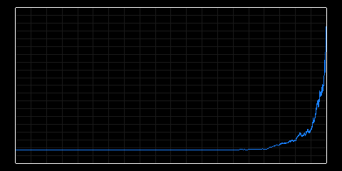

# easy_bo_tester
C++ header-only библиотека для тестирования бинарных опционов

### Описание

Библиотека состоит из нескольких файлов-заголовков и позволяет строить графики кривой баланса, узнавать винрейт стратегии, получать значения просадки и некоторых других коэффициентов.
 
Примечание: В описании функций и методов для обозначения наличия параметров может использоваться сочетание символов *(...)*.

Файл *easy_bo_common.hpp* содержит общеупотребительный код:

* перечисления возможных состояний и настроек

```cpp
    /// Набор возможных состояний и настроек
    enum {
        EASY_BO_BUY = 1,    ///< Бинарный опицон на покупку
        EASY_BO_SELL = -1,  ///< Бинарный опицон на продажу
        EASY_BO_NO_BET = 0, ///< Нет ставки\бинарного опциона
        EASY_BO_WIN = 1,    ///< Успешный бинарный опицон
        EASY_BO_LOSS = -1,  ///< Убычтоный бинарный опцион
        EASY_BO_NEUTRAL = 0,///< Бинарный опцон в ничью
    };
```
* класс BinaryOption для хранения параметров и результата бинарного опциона
* calc_expectation(...) - рассчитать математическое ожидание прибыли
* calc_min_winrate(...) - рассчитать минимальную эффективность стратегии при заданном уровне выплат
* calc_kelly_bet(...) - рассчитать оптимальный процент ставки от депозита по критерию Келли
* calc_profit_stability(...) - рассчитать стабильность прибыли
* calc_geometric_average_retur(...) - рассчитать среднюю геометрическую доходность
* calc_sharpe_ratio(...) - рассчитать коэффициент Шарпа
* calc_balance_drawdown_absolute(...) - рассчитать абсолютную просадку баланса
* calc_balance_drawdown_maximal(...) - рассчитать максимальную просадку баланса
* calc_balance_drawdown_relative(...) - рассчитать относительную просадку баланса (Balance Drawdown Relative)

Файл *easy_bo_simplifed_tester.hpp* содержит класс для упрощенного тестирования стратегий:

* SimplifedTester - Класс простого тестера для измерения эфективности торговли бинарными опицонами
* метод get_winrate() - Получить винрейт, число от 0.0 до 1.0
* метод get_deals() - Получить количество сделок
* метод get_wins() - Получить число выигрышей
* метод get_losses() - Получить число проигрышей
* метод add_deal(const int8_t &result) - Добавить сделку
* метод clear() - Очистить состояние тестера
* метод init(...) - Инициализировать тестер массивом сделок
* метод init(...) - Инициализировать тестер массивом сделок
* метод get_expected_value(...) - Получить математическое ожидание прибыли

Файл *easy_bo_standard_tester.hpp* содержит класс для расширенного тестирования стратегий:

* StandardTester - Класс стандартного тестера для измерения эфективности торговли бинарными опицонами
* Конструктор StandardTester(bo_start_deposit = 1000.0) - Конструктор класса для использования тестера без меток времени
* Конструктор StandardTester(bo_start_deposit, bo_start_timestamp) - Конструктор класса для использования тестера с меткой времени
* метод add_deal(...) - Добавить сделку
* метод update_delay(...) - Обновить задержку между сделками
* метод update_timestamp(...) - Обновить текущее время
* метод stop() - Остановить тестирование
* метод clear() - Очистить состояние тестера
* метод get_expected_value(const T &profit, const T &loss = 1.0) - Получить математическое ожидание прибыли
* метод get_winrate() - Получить винрейт, число от 0.0 до 1.0
* метод get_deals() - Получить количество сделок
* метод get_wins() - Получить количество удачных сделок
* метод get_losses() - Получить количество убыточных сделок
* метод get_balance_curve() - Получить кривую баланса
* метод get_equity_curve() - Получить кривую средств
* метод get_gross_profit() - Получить общую прибыль (Gross Profit)
* метод get_gross_loss() - Получить общий убыток (Gross Loss)
* метод get_total_net_profit() - Получить чистую прибыль (Total Net profit)
* метод get_profit_factor() - Получить прибыльность (Profit Factor)
* метод get_balance_drawdown_absolute(...) - Получить абсолютную просадку баланса (Balance Drawdown Absolute)
* метод get_balance_drawdown_maximal(...) - Получить максимальную просадку баланса (Balance Drawdown Maximal)
* метод get_balance_drawdown_relative(...) - Получить относительную просадку баланса (Balance Drawdown Relative)
* метод get_sharpe_ratio(...) - Получить коэффициент Шарпа (Данный метод пригоден только для экспоненциального роста депозита)

### Как использовать

Пример программы стандартного тестера:

```cpp
	#include <iostream>
	#include "easy_bo_standard_tester.hpp"
	#include <random>
	#include <ctime>
	
	//...
	
    std::cout << "start test" << std::endl;
    /* инициализируем генератор случайных чисел */
    std::mt19937 gen;
    gen.seed(time(0));
    std::uniform_int_distribution<> denominator(0, 1000);
    /* инициализируем тестер с начальным депозитом 1000 */
    easy_bo::StandardTester iStandardTester(1000);
    /* начинаем имитацию торговли */
    for(uint32_t i = 0; i < 1000; ++i) {
        double p = (double)denominator(gen)/1000.0;
        if(p <= 0.56) iStandardTester.add_deal(easy_bo::EASY_BO_WIN, 180, 0.8, 0.03);
        else iStandardTester.add_deal(easy_bo::EASY_BO_LOSS, 180, 0.8, 0.03);
        iStandardTester.update_delay(60);
    }
    /* завершаем торговлю */
    iStandardTester.stop();
    /* выводим некоторые статистические данные */
    std::cout << "test-2 winrate: " << iStandardTester.get_winrate() << std::endl;
    std::cout << "test-2 wins: " << iStandardTester.get_wins() << std::endl;
    std::cout << "test-2 losses: " << iStandardTester.get_losses() << std::endl;
    std::cout << "test-2 profit factor: " << iStandardTester.get_profit_factor() << std::endl;
    std::cout << "test-2 balance drawdown relative: " << iStandardTester.get_balance_drawdown_relative() << std::endl;
    std::cout << "test-2 sharpe ratio: " << iStandardTester.get_sharpe_ratio() << std::endl;
    std::cout << "test-2 expected payoff: " << iStandardTester.get_expected_payoff(0.8) << std::endl;
    std::cout << "test-2 total net profit: " << iStandardTester.get_total_net_profit() << std::endl;
```

Пример программы для тестирования ТС на исторических данных можно найти в папке *code_bloocks/standard_tester_with_balance_chart*

Результат программы:

*График роста депозита*



*Некоторые статистические данные*


### Зависимости

Библиотека зависит от:

* C++ библиотека  для работы с временем и датой *xtime_cpp* - [https://github.com/NewYaroslav/xtime_cpp](https://github.com/NewYaroslav/xtime_cpp)

Остальные зависисмости нужны только для программы, расположенной тут: *code_bloocks/standard_tester_with_balance_chart*
"Почти" все зависимости это header-only библиотеки.

* Рисование графиков в С++ на базе *freeglut* - [easy_plot_cpp](https://github.com/NewYaroslav/easy_plot_cpp)
* Библиотека для хранения и доступа к данным в сжатом виде (котировки и пр.) - [xquotes_history](https://github.com/NewYaroslav/xquotes_history) 
* Библиотека технического анализа: https://github.com/NewYaroslav/xtechnical_analysis
* Исторчиеские данные FXCM: https://github.com/NewYaroslav/finam_history_quotes

Все зависимости добавлены как субмодули в папку *lib*

### Полезные ссылки

* Рисование графиков в С++ на базе *freeglut* - [easy_plot_cpp](https://github.com/NewYaroslav/easy_plot_cpp)
* Библиотека для хранения и доступа к данным в сжатом виде (котировки и пр.) - [xquotes_history](https://github.com/NewYaroslav/xquotes_history) 
* Котировки от *Финам* сжатые при помощи библиотеки *xquotes_history* - [finam_history_quotes](https://github.com/NewYaroslav/finam_history_quotes)
* Котировки от *binary.com* сжатые при помощи библиотеки *xquotes_history* - [binary.com_history_quotes](https://github.com/NewYaroslav/binary.com_history_quotes)
* Библиотека технического анализа для С++ - [xtechnical_analysis](https://github.com/NewYaroslav/xtechnical_analysis)

